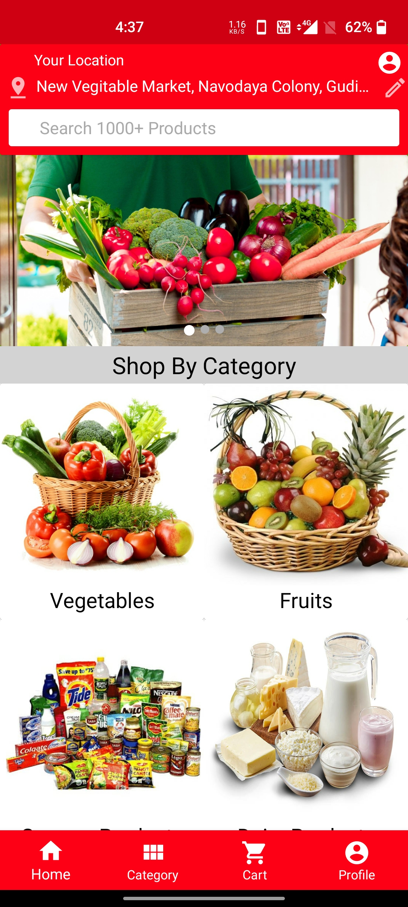
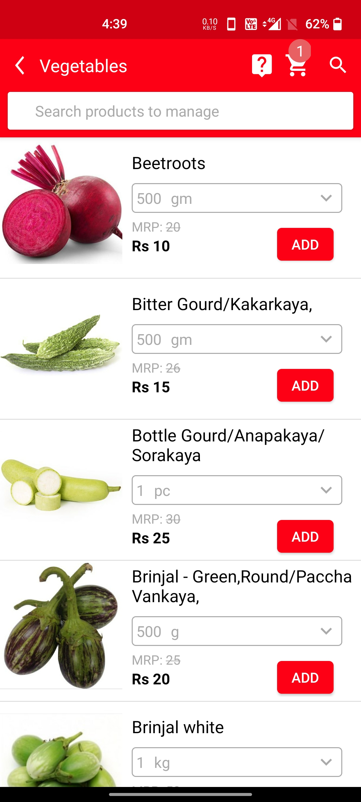
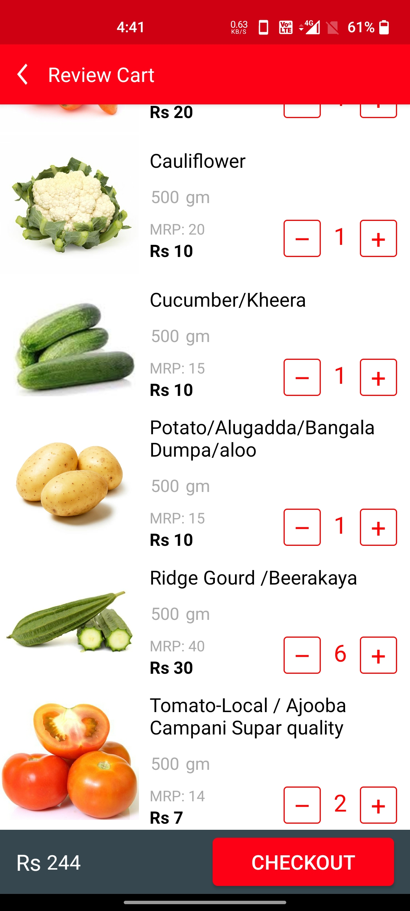
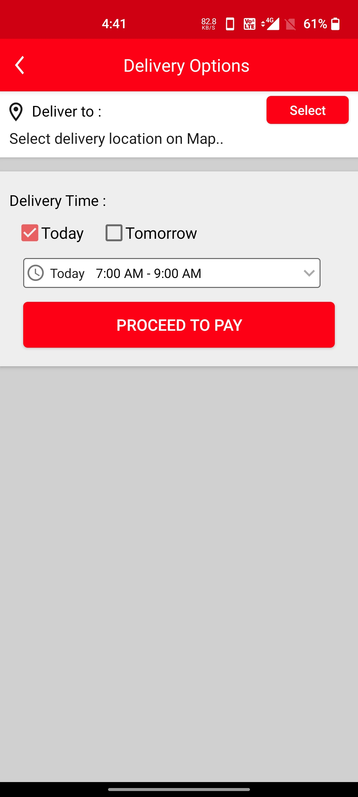

# Ajooba-Grocery Deliver Application For Android

This repository holds the Android App which is a grocery delivery platform. Ajooba Groceries is an E-commerce application that provides the ease to order fresh grocery to the door step for customers.This project has 3 distinct applications for Customer, Admin and Delivery partner and also has a complete end to end order tracking sytem between customer and the admin of the application.

## Features
- Students can see their mess registration for any month.
- Students can cancel their meals in single click
- Students can keep track of their attendance in current as well as past course

##### Upcoming Features
- Mess changing option
- Assignment deadline notificatios and submission
- Courier notifications

##### And all these without any need to logging into any VPN. This app works on any network removing the tiresome job of connecting to intranet everytime students want to check meals/attendance.

      
 
 
 

Solarized dark             |  Solarized Ocean
:-------------------------:|:-------------------------:
  |  

