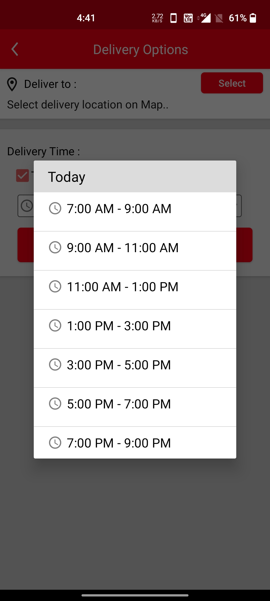
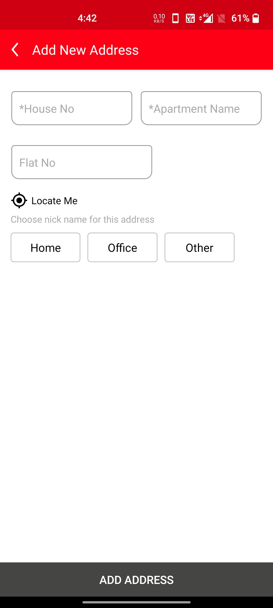
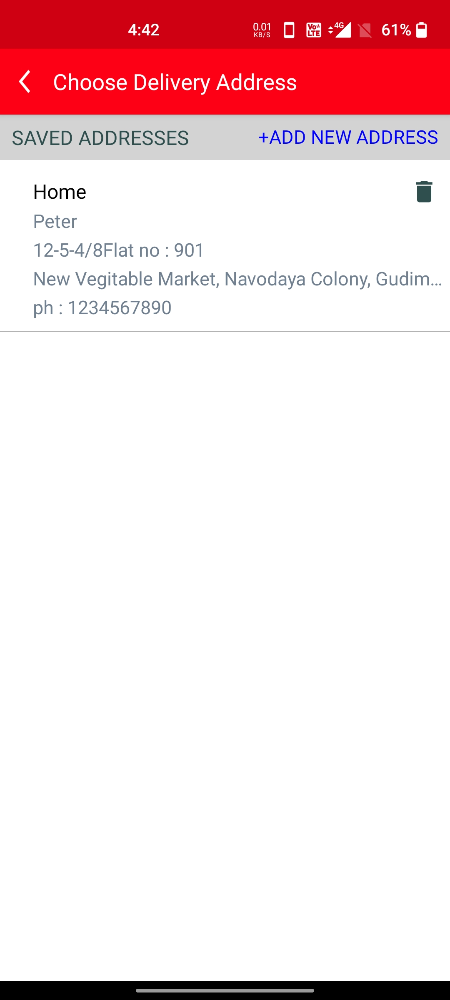
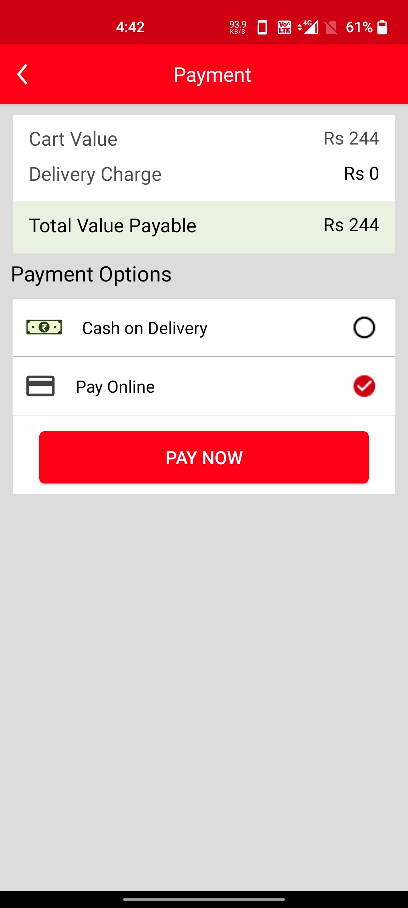

# Ajooba-Grocery Deliver Application For Android

This repository holds the Android App which is a grocery delivery platform. Ajooba Groceries is an E-commerce application that provides the ease to order fresh grocery to the door step for customers.This project has 3 distinct applications for Customer, Admin and Delivery partner and also has a complete end to end order tracking sytem between customer and the admin of the application.

## Features
- User can see all the products listed by admin through admin panel.
- User can add/edit/remove new addresses of delivery through navigation.
- Users can place order by choosing their desired time slot and date.
- Users can save their payment method for future reference.

##### Upcoming Features
- featured products through machine learning
- Referal for user account
- Courier notifications
- Auto order feature

##### The user is provided with a profile activity to view the order data and login and logout from account.

               Home                        |                     Order

    
 
   
 
   
 
   

